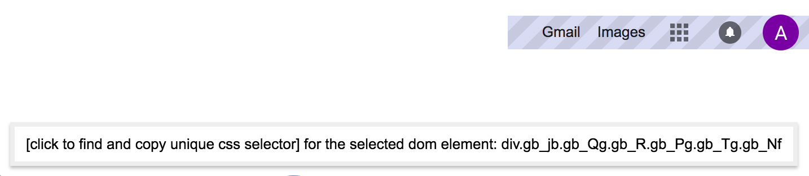

# getselector

Download `GetSelector` from Chrome Web Store: https://chrome.google.com/webstore/detail/get-unique-css-selector/lkfaghhbdebclkklgjhhonadomejckai

Find a very short and unique CSS selector of any item on your page. Hover and click.

The extension helps you to find an unique selector of the DOM elements on any page. Just enable the extension by clicking at the icon, hover an element and click! The unique selector will be copied to the Clipboard. Easy like that! 

Based on https://github.com/antonmedv/finder
